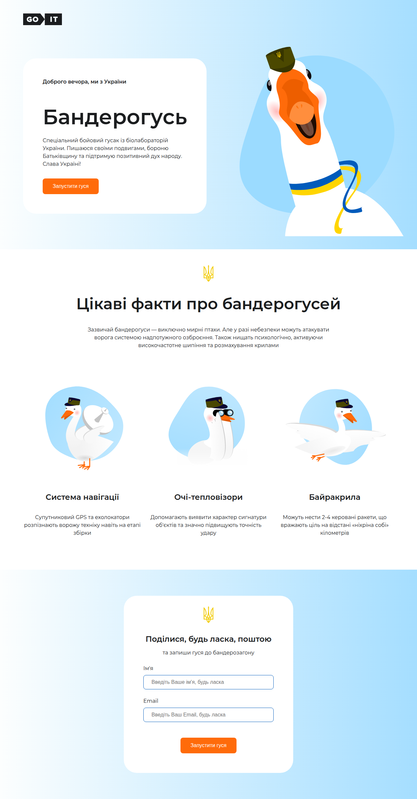

# IT-марафон GOIT: Тест-драйв 5 професій за 8 днів 🚀

<!-- AUTOGEN:STATS -->

## 📸 Latest Screenshot

<!-- END:AUTOGEN -->

Інтенсивний практичний марафон для ознайомлення з IT-професіями. Створюємо
реальний проект крок за кроком!

## 📅 Програма марафону

| Дні      | Професія                    | Навички                         |
| -------- | --------------------------- | ------------------------------- |
| 1-2 день | **Дизайн**                  | Figma, створення макету         |
| 3-5 день | **Розробка**                | HTML/CSS, верстка лендингу      |
| 6 день   | **Дата-аналітика**          | Tableau, створення дашборду     |
| 7 день   | **QA & Project Management** | Тестування, Bug Report, Backlog |
| 8 день   | **Фінал**                   | Огляд професій о 19:30          |

## 🛠 Що ви отримаєте

- Практичний досвід у 5 IT-напрямках
- Власний завершений проект
- Чітке розуміння професій
- Сертифікат учасника

## 🚀 Як долучитися

1. Перейдіть на
   [сторінку марафону](https://vutov-mykola.github.io/test-drive-goit/)
2. Почніть о 19:00 у вказаний день
3. Виконуйте завдання крок за кроком

## 📌 Технології

- Figma (дизайн)
- HTML/CSS (розробка)
- Tableau (аналітика)
- Jira/Trello (PM)

> 💡 Фінальний вебінар 8 дня допоможе вибрати ідеальну IT-професію!

Figma :
[сторінку марафону](https://www.figma.com/design/sYlrbDCOTleicni97EB9RL/1_Design-TD_full-design?node-id=0-1&t=E4bYYGGtkLv87r2p-1)

Tableau
Public:[сторінку марафону](https://public.tableau.com/views/TestDrive_17537220837000/Dashboard1?:language=en-US&:sid=&:redirect=auth&:display_count=n&:origin=viz_share_link)
